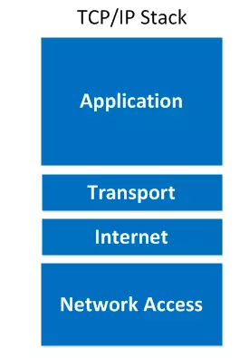
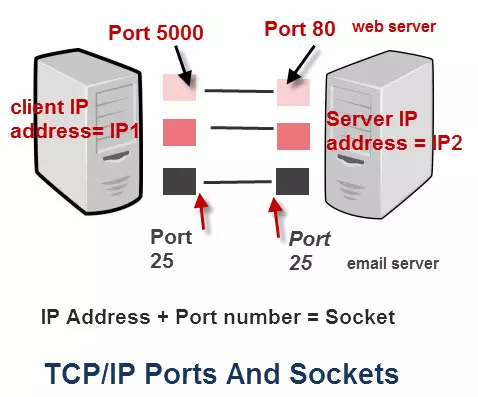

# Mô hình TCP-IP

1. Tổng quan

- `TCP/IP` là một phương thức truyền dẫn được sử dụng khá rộng rãi với internet ngày nay
- `TCP/IP` là tên viết tắt của cụm từ `Transmission Control Protocol/Internet Protocol` (Giao thức điều khiển truyền dẫn / Giao thức mạng). Đây là một tập hợp các giao thức trao đổi thông tin được sử dụng để truyền tải và kết nối các thiết bị mạng internet. TCP/IP chỉ rõ cho chúng ta cách thức đóng gói thông tin (Gói tin) được gửi và nhận bởi các máy tính có kết nối với nhau



2. Mô hình TCP/IP tiêu chuẩn gồm 4 tầng được chồng lên nhau là:

- **Tầng 1: Vật lý (Network Access)**
  - Nó là sự kết hợp của tầng Data Link và Physical trong mô hình OSI (Mô hình này các bạn tìm hiểu thêm nhé. Bản chất nó cũng tương tự như TCP/IP)
  - Là tầng thấp nhất trong mô hình TCP/IP.
  - Chịu trách nhiệm truyền dữ liệu giữa các thiết bị trong cùng một mạng. Tại đây, các gói dữ liệu được đóng vào khung (Frame) và được định tuyến đi đến đích được chỉ định ban đầu.
- **Tầng 2: Tầng mạng (Internet)**
  - Xử lý quá trình truyền gói tin trên mạng.
  - Định tuyến: tìm tuyến đường qua các nút trung gian để gửi dữ liệu từ nguồn tới đích.
  - Chuyển tiếp: chuyển tiếp gói tin từ cổng nguồn tới cổng đích theo tuyến đường.
  - Định địa chỉ : định danh cho các nút mạng.
  - Đóng gói dữ liệu: nhận dữ liệu từ giao thức ở trên, chèn thêm phần Header chứa thông tin của tầng mạng và tiếp tục được chuyển đến tầng tiếp theo.
  - Đảm bảo chất lượng dịch vụ(QoS): đảm bảo các thông số phù hợp của đường truyền theo từng dịch vụ.
  - Các giao thức của tầng này bao gồm: IP (Internet Protocol - giao thức được sử dụng rộng rãi trong mọi hệ thống mạng trên phạm vi toàn thế giới), ICMP (Internet Control Message Protocol), IGMP (Internet Group Message Protocol).
- **Tầng 3: Tầng giao vận (Transport)**
  - Chịu trách nhiệm duy trì liên lạc đầu cuối trên toàn mạng
  - Tầng này có 2 giao thức chính là TCP ( Transmisson Control Protocol) và UDP ( User Datagram Protocol )
    - TCP sẽ đảm bảo chất lượng truyền gửi gói tin, nhưng tốn khá nhiều thời gian để kiểm tra đầy đủ thông tin từ thứ tự dữ liệu cho đến việc kiểm soát vấn đề tắc nghẽn lưu lượng dữ liệu.
    - Trái với TCP, UDP có thấy tốc độ truyền tải nhanh hơn nhưng lại không đảm bảo được chất lượng dữ liệu được gửi đi (tức là nó không quan tâm dữ liệu có đến được đích hay không).
- **Tầng 4: Tầng ứng dụng (Application)**
  - Cung cấp giao tiếp đến người dùng
  - Cung cấp các ứng dụng cho phép người dùng trao đổi dữ liệu ứng dụng thông qua các dịch vụ mạng khác nhau(Như duyệt web, chat, gửi email, ...)
  - Dữ liệu khi đến đây sẽ được định dạng theo kiểu byte nối byte, cùng với đó là các thông tin định tuyến giúp xác định đường đi đúng của một gói tin.
  - Một số giao thức trao đổi dữ liệu:
    - FTP (File Transfer Protocol): giao thức chạy trên nền TCP cho phép truyền các file ASCII hoặc nhị phân theo 2 chiều
    - TFTP (Trival File Transfer Protocol) : giao thức truyền file chạy trên nền UDP.
    - SMTP ( Simple Mail Transfer Protocol) : giao thức dùng để phân phối thư điện tử.
    - Telnet : cho phép truy nhập từ xa để cấu hình thiết bị.
    - SNMP (Simple Network Managerment Protocol) : Là ứng dụng chạy trên nền UDP , cho phép quản lý và giám sát các thiết bị mạng từ xa.
    - Domain Name System ( DNS) : Là giao thức phân giải tên miền, được sử dụng trong hỗ trợ truy nhập Internet.

3. Cách thức hoạt động của TCP/IP


- Khi truyền dữ liệu , quá trình tiến hành từ tầng trên xuống tầng dưới, qua mỗi tầng dữ liệu được thêm vào thông tin điều khiển gọi là Header.
- Khi nhận dữ liệu thì quá trình xảy ra ngược lại, dữ liệu được truyền từ tầng dưới lên và qua mỗi tầng thì phần header tương ứng sẽ được lấy đi và khi đến tầng trên cùng thì dữ liệu không còn phần header nữa.
  - Ở đây, IP có vai trò quan trọng, nó cho phép các gói tin được gửi đến đích đã định sẵn, bằng cách thêm các thông tin dẫn đường (chính là Header) vào các gói tin để các gói tin được đến đúng đích đã định sẵn ban đầu.
  - Giao thức TCP đóng vai trò kiểm tra và đảm bảo sự an toàn cho mỗi gói tin khi đi qua mỗi trạm. Trong quá trình này, nếu giao thức TCP nhận thấy gói tin bị lỗi, một tín hiệu sẽ được truyền đi và yêu cầu hệ thống gửi lại một gói tin khác.


=> Hình trên là cấu trúc dữ liệu qua các tầng. Trong hình mọi người sẽ thấy ở mỗi tầng khác nhau dữ liệu được truyền vào là khác nhau

- Tầng ứng dụng: dữ liệu là các luồng được gọi là stream.
- Tầng giao vận: đơn vị dữ liệu mà TCP gửi xuống gọi là TCP segment.
- Tầng mạng: dữ liệu mà IP gửi xuống tầng dưới gọi là IP Datagram
- Tầng liên kết: dữ liệu được truyền đi gọi là frame.

- Ưu điểm của TCP/IP
  - Không chịu sự kiểm soát của bất kỳ tổ chức nào => chúng ta có thể tự do trong việc sử dụng
  - Có khả năng tương thích cao với tất cả các hệ điều hành, phần cứng máy tính và mạng => hoạt động hiệu quả với nhiều hệ thống khác nhau.
  - Có khả năng mở rộng cao, có thể định tuyến => có thể xác định được đường dẫn hiệu quả nhất.

# Giao thức TCP và UDP

- TCP và UDP đều là hai giao thức cốt lõi nằm ở tầng giao vận (Transport) thuộc giao thức TCP/IP có khả năng gửi tin đến các máy chủ khác trong mạng giao thức Internet.
- Tìm hiểu thêm trên mạng

# PORT

- Port là giao thức bit 16 đứng đầu của mỗi tập tin trong giao thức TCP, UDP hay còn gọi là cánh cổng quy định các tập dữ liệu riêng biệt. Nó là một dạng thuật toán được định sẵn mà mỗi máy tính cần phải có mới có thể nhận và xuất tập tin được. Port cũng được quy đổi giống như số bit của bất cứ một mã dữ liệu nào đó. Nói một cách dễ hiểu thì `PORT` như một lính gác có quyền quyết định cho hay không cho những dữ liệu nào đó có thể ra vào hệ thống máy tính.
  - Cần 1 địa chỉ IP, bạn xác định được một máy trong một mạng, nhưng nếu chúng chạy cùng nhiều dịch vụ khác nhau thì phải có cách để phân biệt được chúng và lúc này bạn cần đến Port.
  - Ví dụ, Server A chạy dịch vụ website, DNS và FTP server, có địa chỉ IP là `211.445.026.16` => Máy tính nào khác muốn truy cập vào server A thì đến địa chỉ IP hoặc tên miền của máy chủ A. Nhưng cần phải biết Port để đi đúng đến đích đến website A chẳng hạn, thay vì đi sai đến DNS hay FTP của A. Lúc này gói tin gửi đi có IP là 211.445.026.16 kèm địa chỉ Port là 80. Tương tự máy B muốn đến FTP của A thì lúc này địa chỉ IP vẫn thế những Port sẽ là 21. Máy C muốn truy cập DNS của A thì Port là 53, IP giống nhau.
- Chức năng của PORT:
  - `Giúp chọn lọc tin`: Là một thuật toán mà các máy đều cần phải đăng ký để sử dụng, Port quy định chỉ những tập tin nào mới được phép đi vào máy, tương tự với các tập tin được phép xuất ra khỏi máy. Thao tác kiểm tra khớp cổng bit sẽ giúp bạn kiểm soát và chọn lọc được đâu là tập tin an toàn, đâu là tập đang có vấn đề, từ đó từ chối quyền truy cập.
  - `Có khả năng bảo vệ xâm nhập có hại cho máy tính`: nếu hệ thống máy chủ thiếu đi Port, thông tin độc hại ra vào tự do và phá hủy đi dữ liệu của bạn.
- Những loại PORT phổ biến hiện nay:
  - Port có tổng cộng là 65535 cổng được chia làm 3 phần: Well Known Port (WKP) bao gồm các Port quy định từ 0 – 1023, quy định cho các ứng dụng như website (Port 80), FTP (Port 21), email (Port 25); Registered Port (RP) bao gồm các Port từ 1024 – 49151; Dynamic/Private Port (D/PP) bao gồm các Port từ 49152 – 65535. Theo quy định của IANA thì WKP và RP phải được đăng ký với IANA trước khi sử dụng.
  - 20 – TPC – File Transfer – FTP data: cho phép upload và dowload dữ liệu từ server
  - 21 – TPC – File Transfer – FTP control: Khi có máy tính muốn kết nối với dịch vụ FTP của máy bạn, máy đó sẽ tự động phải thêm Port và tìm cách kết nối đến cổng 21 theo mặc định. Khi đầu bit khớp cổng 21 mở cho máy muốn tới FTP để đăng nhập và nối tới server của các bạn
  - 22 – TPC /UDP – SSH Remote Login Protocol: Nếu bạn chạy SSH Secure Shell, cổng 22 được yêu cầu cho người dùng SSH để kết nối tới người phục vụ của bạn.
  - 23 – TPC – Telnet: Trường hợp bạn chạy một người phục vụ Telnet, cổng này được yêu cầu cho người dùng Telnet kết nối tới người phục vụ của các bạn. Telnet có thể được sử dụng để kiểm tra công tác dịch vụ ở cả các cổng khác.
  - 25 – TPC – Simple Mail Transfer Protocol (SMTP): khi có thư tới server SMTP của bạn, chúng sẽ cố gắng tiến vào server thông qua Cổng 25 theo mặc định. 38 – TPC – Route Access Protocol (RAP)
  - 42 – TPC -Host Name Server – Microsoft WINS
  - 45 – TPC – Message Processing Module (receive)
  - 46 – TPC -Message Processing Module (send)
  - 50 – TPC – Remote Mail Checking Protocol (RMCP)
  - 66 – TPC – Oracle SQLNET
  - 80 – Hyper-Text Transfer Protocol (HTTP): khi có người dùng sử dụng địa chỉ IP hay tên miền của bạn, bộ duyệt sẽ giám sát địa chỉ IP trên cổng 80 theo mặc định dành cho website, đồng thời hỗ trợ HTML và các tệp website khác ví dụ như ASP – Active Server Pages
  - 81: Khi một người sử dụng nhập địa chỉ IP hay HostName của các bạn trong bộ duyệt, bộ duyệt sẽ quan sát địa chỉ IP trên cổng 80. Nếu Cổng thì bị tắc nghẽn, Cổng 81 được sử dụng như một Cổng xen kẽ cho một web hosting vietnam nào đó.
  - 88- TPC -Trivial File Transfer Protocol (TFTP)
  - 110 – TCP UDP – Post Office Protocol (POP) Version 3: bạn chạy một máy, người dùng sẽ tiến hành truy cập theo đường POP3 (Nghi thức cơ quan bưu điện) hay IMAP4 (giao thức truy nhập Thông báo Internet) theo quy định. Trong đó thì POP3 đường tốt nhất để truy cập hòm thư.
  - 119 – TCP UDP – Network News Transfer Protocol: bạn chạy server về tin tức, những người dùng muốn kết nối tới các thông tin thì sẽ bắt buộc phải thông qua cổng 119 theo mặc định.
  - 130 – TCP UDP – Cisco FNATIVE
  - 143 – TCP UDP – Internet Message Access Protocol (IMAP) Mail Server: giao thức truy cập thông báo Internet ngày càng trở nên phổ biến hơn bao giờ hết và cho phép sử dụng từ xa. Vì thế, các thông báo đều được giữ ở server để dễ dàng truy cập trực tuyến, online, offline.
  - 161 – TCP UDP – SNMP

# Bài 1: Lập trình Socket TCP

1. Cơ bản về Socket

- Socket là giao diện lập trình ứng dụng mạng được dùng để truyền và nhận dữ liệu trên internet. Giữa hai chương trình chạy trên mạng cần có một liên kết giao tiếp hai chiều, hay còn gọi là two-way communication để kết nối 2 process trò chuyện với nhau. Điểm cuối (endpoint) của liên kết này được gọi là socket.
  - Socket = IP adress + portnumber
- Chức năng chính của Socket là để "duy trì kết nối" giữa client với server để ứng dụng có thể hoạt động realtime. Chẳng hạn như một ứng dụng nhắn tin, Socket sẽ được sử dụng để "lắng nghe" mỗi khi có tin nhắn mới, reaction... ect để cập nhật lên giao diện. Việc cập nhật dữ liệu thời gian thực như thế đem lại một trải nghiệm tuyệt vời cho người dùng,

2. Socket hoạt động như thế nào?

- Socket hoạt động trên cả giao thức TCP và UDP, Có thể xem `Socket = Địa chỉ IP + Số Port`
- Socket hoạt động ở tầng 4 của mô hình OSI (Transport layer)



- Như chúng ta đã biết thì có những port được server service quy định dùng cho các dịch vụ quy định (Assigned Numbers Authority). (Port 80 dùng cho giao thức HTTP, 20 dùng cho FTP, 22 dùng cho SSH, 25 dùng cho SMTP, ...ect).

- Quá trình khởi tạo kết nối tới Gmail sẽ diễn ra như sau:
  - B1. Client có địa chỉ IP1 đang có port 5000 rảnh dỗi và quyết định sử dụng cặp (IP, Port) = (IP1, 5000) để kết nối tới web server có địa chỉ IP2 và port 80 (để chạy giao thức HTTP => lấy về giao diện trang web)
  - B2. Sau khi client được server xác thực thành công và đã có đủ thông tin cần thiết, nó sẽ mở cổng số 25 cho địa chỉ IP2. Lưu ý là client không hề gửi request đi mà chỉ mở port 25 cho web server.
  - B3. Khi có email mới, server sẽ kiểm tra xem kết nối tới (IP1, 25) có còn sống hay không, nếu có thì nó sẽ gửi thông báo về cho client.

=> làm sao để client và server có thể duy trì được kết nối ? Đến đây mình có thể hiểu tại sao cặp (IP, port) lại được gọi là socket vì nó đi theo cặp như 2 đầu của một ổ cắm vậy.

=> Sở dĩ 2 máy có thể duy trì được kết nối là do port đã được mở và sẽ không đóng cho đến khi chiều bên kia gửi tín hiệu muốn chấm dứt bằng cách gửi gói tin RST. Trong trường hợp chiều bên kia ngắt kết nối mà không gửi RST thì kết nỗi vẫn sẽ được đóng sau một khoảng timeout nào đó được quy định ở quá trình Keep-Alive.

- Quá trình Keep-Alive có 3 thuộc tính để quyết định có đóng kết nối hay không:

  - `tcp_keepalive_time`: Khoảng thời gian không có tín hiệu. Mặc định là 7200s. -` tcp_keepalive_intvl`: Khoảng thời gian chờ chiều bên kia hồi đáp. Mặc định là 75s.
  - `tcp_keppalive_probles`: Số lần sẽ thử lại nếu việc giao tiếp gặp lỗi. Mặc định là 9.

- Quá trình Keep-Alive sẽ diễn ra như sau:
  - B1. Client mở kết nối TCP.
  - B1. Sau một khoảng thời gian `tcp_keepalive_time`, nếu như server kia im lặng không có tín hiệu gì. Client sẽ gửi đi cờ ACK (kích thước rất nhỏ, có thể không được xem là một package) đến server và chờ hồi đáp.
  - B3. Server có hồi đáp ACK hay không ?
    - B3.1. Nếu không hồi đáp: Kiểm tra xem số lần thử lại đã vượt quá `tcp_keppalive_probles` hay chưa ? Nếu chưa thì tiến hành đợi sau khoảng tcp_keepalive_intvl rồi gửi lại ACK và quay lại bước 3. Nếu đã vượt quá tcp_keepalive_probes thì gửi RST đến server (không quan tâm đến kết quả trả về) rồi đóng kết nối.
    - B3.2. Nếu server hồi đáp:
      - Nếu hồi đáp đúng => reset lại các thuộc tính rồi quay về bước 2.
      - Nếu hồi đáp sai => chuyển sang 3.1

=> Như vậy thì mặc định, client socket sẽ mở : `tcp_keepalive_time`+ `tcp_keepalive_intvl` \* `tcp_keepalive_probes` = 7200 + 75 \* 9 (giây) = 2h11p nếu như không nhận được RST của server. Tuy nhiên những thuộc tính đó chỉ là mặc định, chúng ta hoàn toàn có thể tùy chỉnh lại theo nhu cầu

3. Phân loại Socket

- `Stream Socket`: Dựa trên giao thức TCP( Tranmission Control Protocol), việc truyền dữ liệu chỉ thực hiện giữa 2 quá trình đã thiết lập kết nối. Do đó, hình thức này được gọi là socket hướng kết nối.

  - Ưu điểm: Có thể dùng để liên lạc theo mô hình client và sever. Nếu là mô hình client /sever thì sever lắng nghe và chấp nhận từ client. Giao thức này đảm bảo dữ liệu được truyền đến nơi nhận một cách đáng tin cậy, đúng thứ tự nhờ vào cơ chế quản lý luồng lưu thông trên mạng và cơ chế chống tắc nghẽn. Đồng thời, mỗi thông điệp gửi phải có xác nhận trả về và các gói tin chuyển đi tuần tự.
  - Hạn chế: Có một đường kết nối (địa chỉ IP) giữa 2 tiến trình nên 1 trong 2 tiến trình kia phải đợi tiến trình kia yêu cầu kết nối.

- `Datagram Socket`: Dựa trên giao thức UDP( User Datagram Protocol) việc truyền dữ liệu không yêu cầu có sự thiết lập kết nối giữa 2 quá trình. Do đó, hình thức này được gọi là socket không hướng kết nối.
  - Ưu điểm: Do không yêu cầu thiết lập kết nối, không phải có những cơ chế phức tạp nên tốc độ giao thức khá nhanh, thuận tiện cho các ứng dụng truyền dữ liệu nhanh như chat, game…..
  - Hạn chế: Ngược lại với giao thức TCP thì dữ liệu được truyền theo giao thức UDP không được tin cậy, có thế không đúng trình tự và lặp lại.

4. Lập trình socket tcp

**B1/** Tạo connect tới server (google)

```python
# modules
import socket
import sys

try:
    s = socket.socket(socket.AF_INET, socket.SOCK_STREAM)
    print ("Socket successfully created")
except socket.error as err:
    print ("socket creation failed with error %s" %(err))

# default port for socket
port = 80

try:
    host_ip = socket.gethostbyname('www.google.com')
except socket.gaierror:
    print ("there was an error resolving the host")
    sys.exit()

# connecting to the server
s.connect((host_ip, port))
print ("the socket has successfully connected to google on PORT: " + host_ip)
```

- Tạo một socket instance với 2 tham số:
  - tham số đầu tiên AF_INET đại diện cho họ địa chỉ ipv4
  - SOCK_STREAM được hiểu là giao thức TCP hướng kết nối (connection-oriented)
- Kết nối với google
- Bây giờ, làm thế nào để gửi một số dữ liệu thông qua `socket`
- Thư viện socket có `sendall function` cho phép chúng ta gửi dữ liệu tới server mà soket được kết nối và server cũng có thể gửi dữ liệu đến client bằng chức năng này.

**B2/** Server - Server có phương thức bind() liên kết nó với một IP và cổng cụ thể để có thể lắng nghe các yêu cầu đến trên IP và cổng đó - Server có phương thức `listen()` đặt máy chủ ở chế độ `listening`. Điều này cho phép máy chủ `listen` các kết nối đến. Máy chủ cũng có phương thức `accept()` để khởi tạo kết nối với `client` và `close()` để đóng kết nối với `client`.

```python
import socket
# next create a socket object
s = socket.socket()

# reserve a port on your computer in our (case it is 12345 but it can be anything)
port = 12345

# Next bind to the port
# we have not typed any ip in the ip field
# instead we have inputted an empty string
# this makes the server listen to requests
# coming from other computers on the network
s.bind(('', port))
print ("socket binded to %s" %(port))

# put the socket into listening mode
s.listen(5)

# a forever loop until we interrupt it or
# an error occurs
while True:
# Establish connection with client.
  c, addr = s.accept()
  print ('Got connection from', addr )

  # send a thank you message to the client. encoding to send byte type.
  c.send('Thank you for connecting'.encode())

  # Close the connection with the client
  c.close()

  # Breaking once connection closed
  break
```

- Tạo socket object và để riêng một cổng trên máy tính của mình
- Sau đó liên kết server với cổng được chỉ định, việc truyền một chuỗi rỗng có nghĩa là máy chủ có thể nghe các kết nối từ những máy tính khác. Nếu chúng ta truyền `127.0.0.1` thì nó sẽ chỉ nghe được những cuộc gọi được thực hiện trong máy tính cục bộ
- Sau đó đặt máy tính ở chế độ `listening`. Số 5 ở đây có nghĩa là có 5 kết nối được `kept waiting` nếu server bận và nếu soket thứ 6 cố gắng kết nối thì sẽ bị từ chối
- Cuối cùng tạo một vòng lặp thời gian và bắt đầu chấp nhận tất cả các kết nối đến và đóng các kết nối đó sau khi thông báo cảm ơn đến tất cả các ổ cắm được kết nối.

**B3/** Client

- Bây giờ chúng ta cần gì đó để máy chủ có thể tương tác. Có thể `telnet` tới server để biết server đang hoạt động.

```terminal
# start the server
$ python server.py

# keep the above terminal open
# now open another terminal and type:

$ telnet localhost 12345
```

**B4/** Client Side

```py
import socket

s = socket.socket()

# Define the port on which you want to connect
port = 12345

# connect to the server on local computer
s.connect(('127.0.0.1', port))

# receive data from the server and decoding to get the string.
print(s.recv(1024).decode())
# close the connection
s.close()
```

- Kết nối với máy chủ cục bộ trên cổng 12345 (Port mà server đang chạy) và cuối cùng nhận dữ liệu từ máy chủ và đóng kết nối
- Bây giờ chạy như sau:

```terminal
# start the server:
$ python server.py
socket is listening
Got connection from ('127.0.0.1', 52617)


# start the client:
$ python client.py
Thank you for connecting
```

# Bài 4: Requests module

- `Requests module` là một thư viện hỗ trợ chúng ta có thể gửi bất kì một loại `request http` nào một cách đơn giản nhất

# Bài 4.1: Reponse module

- `USER_AGENT`: (request headres) là một chuỗi đặc trưng cho phép máy chủ và mạng ngang hàng xác định ứng dụng, hệ điều hành, nhà cung cấp, hoặc phiên bản `user agent` yêu cầu
  - SYNTAX: `User-Agent: <product> / <product-version> <comment>`
- Khi trình duyệt của bạn kết nối với một trang web (website), nó sẽ bao gồm trường User agent trong tiêu đề HTTP của nó. Nội dung của trường User agent khác nhau giữa các trình duyệt. Mỗi trình duyệt có User agent riêng biệt. Về cơ bản, User agent là một cách để trình duyệt nói “Xin chào, tôi là Chrome trên Windows” hoặc “Xin chào, tôi là Safari trên iPhone” với máy chủ web.
- Việc xác định User agent giúp một trang web nhận biết được trình duyệt đó (Giả sử trình duyệt quá cũ thì sẽ hiện lời nhắc nâng cấp trình duyệt)
